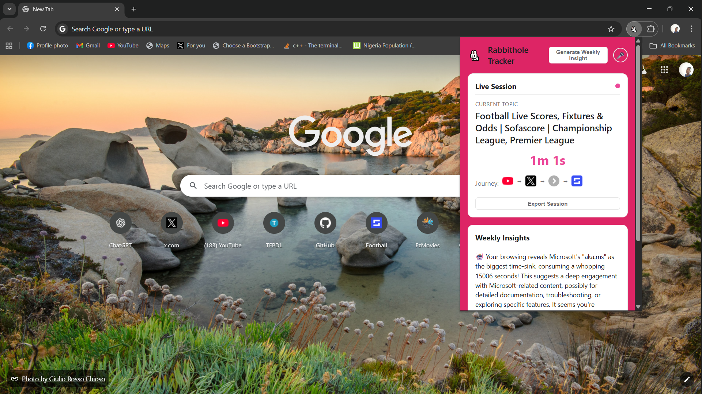
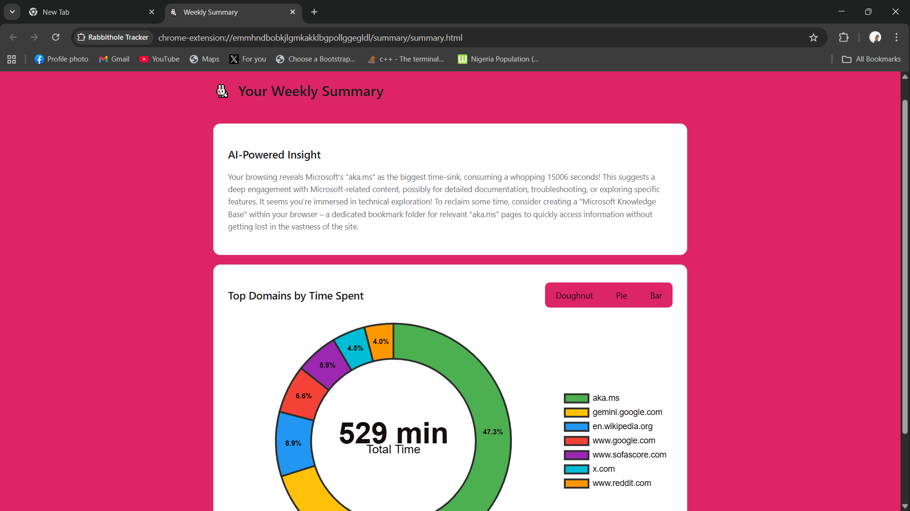
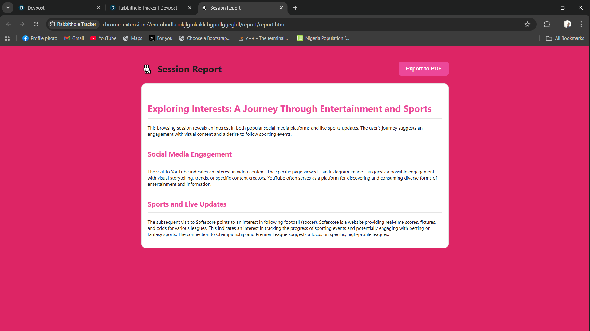

# 🐰 Rabbithole Tracker

An intelligent Chrome extension that uses built-in AI to help you understand, manage, and learn from your browsing rabbitholes.

## The Problem

We've all been there. You start by looking up one simple thing, and three hours later, you've journeyed across a dozen websites and have a hundred open tabs. This extension is designed to combat unintentional time loss by making you aware of your cross-domain journeys, providing AI-powered insights, and giving you the tools to stay focused.

---

## ✨ Key Features

### Intelligent Tracking & Analysis
* **Cross-Domain Session Tracking:** Automatically groups related browsing activities across different websites into a single, coherent "session."
* **Precise Time Measurement:** Differentiates between active time on a page and idle time.
* **Rabbithole Scoring:** A heuristic algorithm scores each session's severity based on duration, domain hops, and topic diversity, labeling them 'Low', 'Medium', or 'High'.

### 🤖 AI-Powered Insights
* **AI Topic Extraction (`Summarizer API`):** Uses Chrome's built-in AI to read and understand the content of webpages, automatically extracting key topics and themes.
* **AI Topic Synthesis (`Prompt API`):** Analyzes the keywords from an entire session and uses the AI to generate a high-level, human-like title (e.g., "Research into WWII and its Key Figures").
* **AI Weekly Insights (`Prompt API`):** Generates a personalized, weekly summary of your browsing habits, identifying potential time-sinks and offering actionable productivity advice.
* **AI Research Reports (`Writer API`):** Transforms a chaotic browsing session into a beautifully formatted and structured article, perfect for research and learning.

### 🛡️ Productivity & Focus Tools
* **Custom Time Limits:** Set daily time limits for specific websites (e.g., `youtube.com`).
* **Automatic Notifications:** Receive a system notification when you exceed a self-imposed daily time limit.

### User Interface & Experience
* **Live Session Popup:** A clean, intuitive popup that shows your current session's topic, a real-time timer, and a visual journey of the domains you've visited.
* **Interactive Data Visualization:** A detailed weekly summary page with interactive charts (Doughnut, Pie, and Bar) to visualize your time spent.
* **Voice Commands (Multimodal):** Use your voice to generate weekly or session reports.
* **PDF Export:** Export your AI-generated session reports as a clean, print-friendly PDF.
* **Light & Fun "Bunny" Theme:** A custom white, pink, and purple color palette for a unique and friendly feel.
* 🌐 **Internationalization (i18n):** The entire extension, including the UI and the AI-generated insights, automatically adapts to the user's browser language (supports English, Spanish, and Portuguese).

---

## 📸 Screenshots

| Popup UI | Weekly Summary | Session Report |
| :---: | :---: | :---: |
|  |  |  |
| *Live session tracking with an AI-synthesized topic.* | *Interactive charts and AI-powered weekly insights.* | *A beautifully formatted research article generated by the Writer API.* |

---

## 🛠️ Technology Stack

* **Platform:** Chrome Extension (Manifest V3)
* **Language:** JavaScript (ES Modules)
* **Internationalization:** Chrome's `i18n` API with `_locales` for language-specific strings.
* **Core APIs:**
    * Chrome Extension APIs (`storage`, `tabs`, `notifications`, `scripting`, `idle`)
    * Web Speech API (for voice commands)
* **Chrome Built-in AI APIs:**
    * `Summarizer API`
    * `Prompt API (LanguageModel)`
    * `Writer API` (via Origin Trial)
* **Libraries:**
    * `Chart.js` & `chartjs-plugin-datalabels` for data visualization.
    * `marked.js` for Markdown rendering.

---

## 🚀 Getting Started

### 1. Prerequisites
* Google Chrome version 138 or newer.
* A compatible system (Windows/macOS/Linux/ChromeOS) that meets the **hardware requirements** for Chrome's built-in AI (specifically, **>4 GB of dedicated VRAM** and **>22 GB of free disk space**).

### 2. Enable AI Flags in Chrome
* Navigate to `chrome://flags`.
* Search for and **Enable** the following flags:
    * `Prompt API for Gemini Nano`
    * `Summarization API for Gemini Nano`
    * `Experimental Web Platform features`
* Relaunch your browser.

### 3. Origin Trial for Writer API
The `Writer API` requires an Origin Trial token.
1.  Go to the [Writer API Origin Trial Registration Page](https://developer.chrome.com/origintrials/#/view_trial/1182415671556112385).
2.  Register and get a token for your extension's ID in the format `chrome-extension://YOUR_EXTENSION_ID`.
3.  Open `manifest.json` and add your token under the `"trial_tokens"` key.

### 4. Load the Extension
1.  Clone or download this repository.
2.  Open Chrome and navigate to `chrome://extensions`.
3.  Enable **"Developer mode"** in the top right corner.
4.  Click **"Load unpacked"**.
5.  Select the `rabbithole-tracker` project folder.

### 5. One-Time AI Model Download
The first time you visit a text-heavy website (like a Wikipedia article), a green button will appear in the bottom-right corner.
* **Click this button** to trigger the one-time download of the Gemini Nano AI model. This may take several minutes.

---

## 🎤 Usage

* **Track:** Simply browse the web. The extension works automatically in the background.
* **View Live Session:** Click the extension's icon in your Chrome toolbar to see your current session's details.
* **Generate Reports:** Use the buttons or voice commands ("generate weekly insight", "export session") in the popup to get your AI-powered reports.
* **Set Limits:** Right-click the extension icon and select "Options" to manage your daily time limits.

---

## 🧠 The Development Journey

### How We Built It
This extension was built from the ground up as a modern **Manifest V3** extension with a focus on a modular JavaScript architecture, separating concerns into modules for time tracking, session management, and AI interaction. The UI was built with vanilla HTML/CSS/JS, with a focus on creating a clean and polished user experience.

### Challenges We Ran Into
The biggest challenge was navigating the experimental nature of the built-in AI APIs. We spent significant time debugging issues related to **hardware requirements** (disk space and VRAM), browser security features like the **"User Gesture" requirement** for downloads, and the instability of APIs in Origin Trial, which required solving manifest key errors (`trial_tokens` vs `origin_trial_token`) through research.

### Accomplishments We're Proud Of
We are incredibly proud to have successfully implemented **three distinct AI APIs** (`Summarizer`, `Prompt`, and `Writer`) in a single, cohesive application. The **AI Topic Synthesis** feature, which generates a high-level title for a browsing session, feels like true intelligence. Overcoming the difficult technical hurdles to create a polished, multi-modal UX with a custom theme and voice commands is a major accomplishment.

### What We Learned
This project was a deep dive into the incredible potential and current limitations of on-device AI. We learned the critical importance of **prompt engineering**—refining our instructions for the AI made a night-and-day difference in the quality of the output. We also gained valuable experience in modern Chrome extension architecture, including service workers, message passing, and storage management.

---

## 🔮 What's Next for Rabbithole Tracker

* **Smarter Blocking:** Use AI topic data for context-aware blocking (e.g., "Block YouTube for entertainment, but allow it for educational content").
* **Historical Timeline:** Create a new UI to visualize past rabbitholes, allowing users to see their patterns over time.
* **Integration with Note-Taking Apps:** Add an "Export to Notion" or "Export to Obsidian" button for the AI-generated session reports, turning the extension into a powerful research tool.